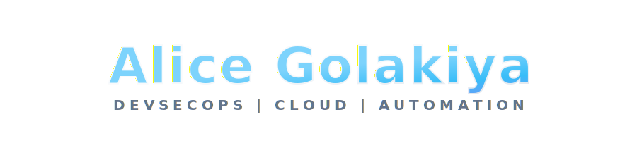

# 🏗️ DevSecOps Architect

### Bridging Security, Infrastructure & Innovation

  

---

## 👋 About Me

I'm a **DevSecOps Architect** passionate about designing secure, scalable cloud infrastructure and automating complex enterprise systems. With expertise spanning cloud platforms, infrastructure-as-code, and security orchestration, I transform organizational challenges into innovative solutions.

- 🎯 **Specialization:** Cloud Infrastructure • DevSecOps • Enterprise Automation • Infrastructure-as-Code
- 🚀 **Focus:** Security-first architecture, GitOps, CI/CD excellence, and scalable automation
- 📚 **Philosophy:** Continuously learning, innovating, and sharing knowledge
- 🔗 **Connect:** [LinkedIn](https://www.linkedin.com/in/alicegolakiya/)

---

## 🛠️ Technical Arsenal

### **DevSecOps & CI/CD**
Azure DevOps • Jenkins • GitOps • HashiCorp Vault • CyberArk

### **Infrastructure as Code**
Terraform • Ansible • Packer • Chef • Python • PowerShell

### **☁️ Cloud Platforms**
- **AWS:** EC2, EKS, Lambda, RDS, S3
- **Azure:** AKS, Azure DevOps, Functions
- **GCP:** Compute Engine, Cloud Run

### **🐳 Containers & Kubernetes**
Docker • Kubernetes (HA/DR, autoscaling) • EKS • AKS

### **🖥️ OS & Compliance**
RHEL • OEL • Windows Server • CIS Benchmarking • Patch Automation

### **🗄️ Databases**
SQL Server • Oracle • ADCS/PKI

### **🔧 Tools & Platforms**
AWX • Tenable • Jira • ServiceNow • SCOM • Tanium

### **💼 Soft Skills**
Technical Leadership • Stakeholder Communication • Problem-Solving • Agile/Scrum

---

## 🎯 Key Projects & Achievements

### 🔐 **IAC DevSecOps Platform**
Architected and implemented enterprise-grade security and infrastructure platform:
- ✅ Designed **HashiCorp Vault** for enterprise secrets management
- ✅ Engineered end-to-end **CI/CD pipelines** for Azure Function Apps
- ✅ Built **CIS-compliant Packer image factories** for standardized VM deployments
- ✅ Implemented **enterprise patch automation** across 7,000+ servers
- ✅ Developed **GenAI-driven GitOps remediation framework** (~90% automation improvement)

### ☸️ **AWX Provisioning on Kubernetes**
Led migration to cloud-native automation platform:
- ✅ Deployed **AWX on managed Kubernetes** with HA/DR capabilities
- ✅ Implemented **intelligent autoscaling** and load balancing
- ✅ Built **Azure DevOps CI/CD pipelines** for lifecycle management

### 🚀 **SEO Enablement Initiative**
Modernized Java application deployment infrastructure:
- ✅ Designed **CI/CD pipelines** for Java applications on managed Kubernetes
- ✅ Led **EC2 to Amazon EKS migration** with zero downtime

### 📦 **HPaaS Migrations & UPaaS Operations**
Managed cross-cloud infrastructure platforms:
- ✅ Developed **Chef cookbooks** for .NET application deployments
- ✅ Engineered **Upgrade and Patch-as-a-Service** across AWS, Azure, GCP

---

## 🏆 Recognition & Awards

| Award | Organization | Period |
|-------|--------------|--------|
| 🥇 **Tech Domain Maestro** | Rise Pinnacle Awards | Q3 2024 |
| 🌟 **Top Performer of the Year** | Pinnacle Awards | 2021 |
| 💎 **Infosys Glory Awards - Topaz** | Infosys | Oct 2022 |

---

## 🎓 Certifications & Credentials

### Microsoft Azure
- **Az-400:** Azure DevOps Engineer Expert
- **Az-104:** Azure Administrator
- **Az-900:** Azure Fundamentals

### Infosys
- **DevOps Professional**
- **SRE Professional**
- **Ansible Professional**
- **Terraform Associate**

### RedHat
- **RHCSA:** Red Hat Certified System Administrator
- **RHCE:** Red Hat Certified Engineer
- **Ansible Automation & Containers/Kubernetes** Certified

### Leadership Development
- **Harvard ManageMentor's Leadership Program**

---

## 🎓 Education

**Bachelor of Science in Physics** 🥇 *Gold Medalist*  
K.K. Shah Jarodwala Maninagar Science College, Gujarat University (Apr 2019)

---

### 💡 *Always innovating at the intersection of security, infrastructure, and automation*

